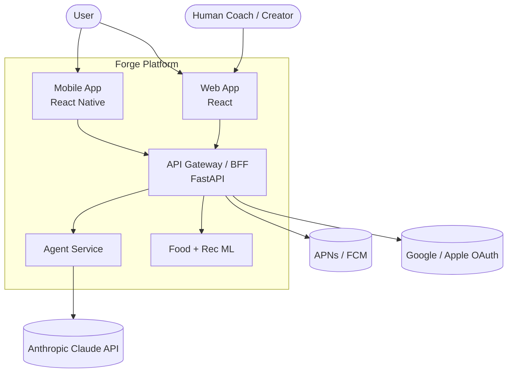
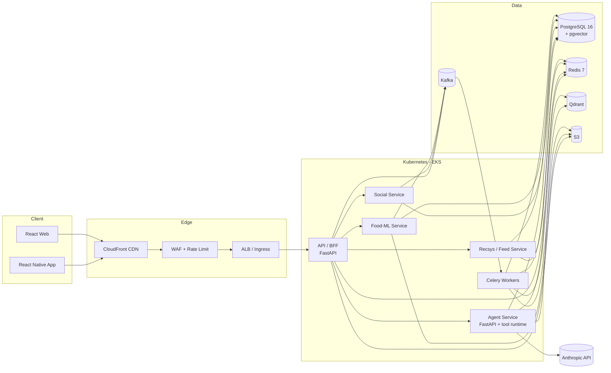
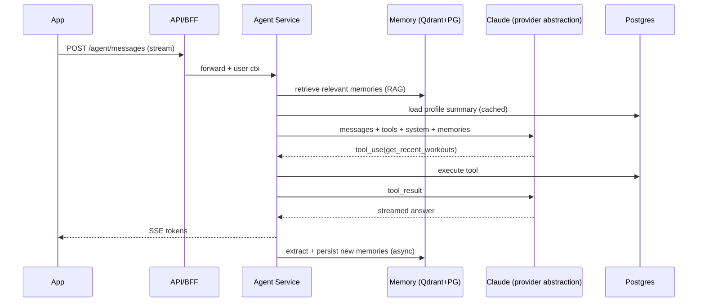
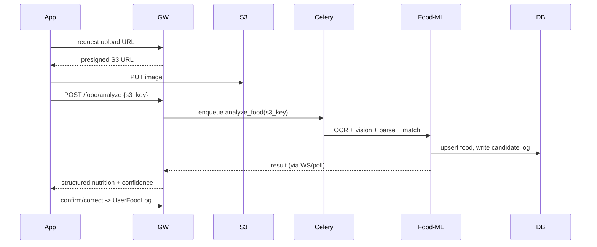
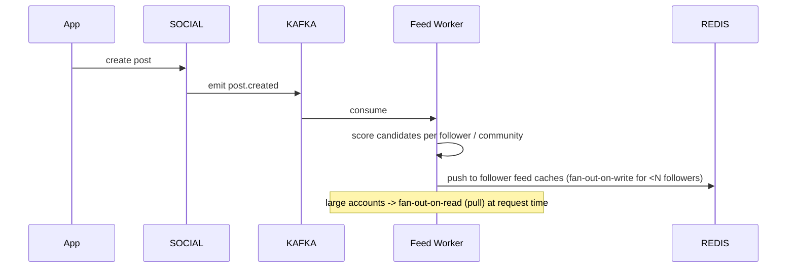

# 01 — System Architecture

## 1. Architectural style

- **Modular monolith → services**: start as a well-bounded modular monolith (FastAPI app with
  internal domains), extract high-load domains (feed, recsys, food-ML, agent) into services as
  traffic demands. This keeps MVP velocity high while leaving clean seams (`docs/15`).
- **Event-driven core**: writes emit domain events to Kafka; consumers handle fan-out (feed),
  embeddings, analytics, notifications, and memory updates — keeping the request path fast.
- **AI-first**: the Agent service is a first-class subsystem, not a bolt-on. It has its own
  memory store, tool runtime, and provider abstraction.

## 2. C4 — Context

## 3. C4 — Containers

## 4. Subsystems

| Subsystem | Responsibility | Key stores |
|---|---|---|
| **API/BFF** | AuthN/Z, request validation, orchestration, REST + WS endpoints | PG, Redis |
| **Agent service** | Agent loop, tool calling, provider abstraction, memory retrieval/write | Qdrant/pgvector, PG, Redis |
| **Food-ML** | OCR, vision inference, nutrition parsing, food matching | PG, S3, Redis |
| **Recsys/Feed** | Feed ranking, candidate generation, people/community recs | PG, Redis, Qdrant |
| **Social** | Posts, comments, likes, follows, communities, moderation | PG, S3 |
| **Workers** | Async pipelines (image, embeddings, fan-out, notifications, analytics) | all |

## 5. Core data flows

### 5.1 Conversational turn (agent)

### 5.2 Food photo logging

### 5.3 Post fan-out (feed)

## 6. Event taxonomy (Kafka topics)

| Topic | Producer | Consumers |
|---|---|---|
| `user.profile.updated` | API/Agent | memory, analytics, recsys |
| `agent.message.completed` | Agent | memory extraction, analytics |
| `food.logged` | API/Food-ML | analytics, agent-memory, streaks |
| `workout.logged` | API | analytics, progress-insights, streaks |
| `post.created` / `post.engaged` | Social | feed fan-out, recsys, analytics |
| `follow.created` | Social | recsys (graph), feed |
| `embedding.requested` | many | embedding worker → Qdrant/pgvector |
| `notification.requested` | many | notification worker → APNs/FCM |

Events use a versioned envelope: `{ event, version, id, occurred_at, actor_id, payload }`,
serialized as JSON (MVP) → Avro/Protobuf + Schema Registry (scale).

## 7. Cross-cutting concerns

- **Idempotency**: client-supplied `Idempotency-Key` on mutating endpoints; dedup in Redis.
- **Tracing**: OpenTelemetry across BFF → Agent → tools → DB; trace id propagated to LLM logs.
- **Config**: 12-factor; secrets in AWS Secrets Manager; feature flags in DB + Redis (see `02`).
- **Multi-tenant isolation**: row-level `user_id` scoping enforced in repository layer + RLS option.
- **Provider abstraction**: all LLM/embedding/vision calls go through an interface (`docs/03 §4`).

## 8. Environments

`local` (docker-compose) → `dev` → `staging` → `prod`. Each prod region is multi-AZ.
Blue/green or canary deploys via Argo Rollouts (`docs/12`).
