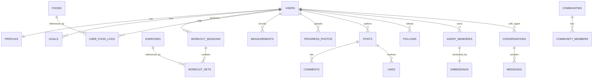

# 02 — Database Design

PostgreSQL 16 is the system of record. `pgvector` provides vector search at MVP scale; hot vector
workloads graduate to Qdrant later (`docs/15`). Below: entities, full DDL, relationships, indexes,
partitioning, and caching.

## 1. Conventions

- All PKs are `UUID` (`gen_random_uuid()`), so IDs are non-enumerable and shard-friendly.
- `created_at`/`updated_at` `timestamptz` on every table; `updated_at` via trigger.
- Soft delete via `deleted_at timestamptz NULL` on user-content tables (hard-delete job for GDPR).
- Money/quantities use `numeric`; never floats for nutrition macros that get summed.
- Enums implemented as Postgres `ENUM` types where stable, `text + CHECK` where they may grow.

## 2. ER overview



## 3. Schema (DDL)

> Grouped by domain. This is the canonical schema; Alembic migrations live in `backend/alembic`.

### 3.1 Identity & profile

```sql
CREATE EXTENSION IF NOT EXISTS pgcrypto;
CREATE EXTENSION IF NOT EXISTS vector;
CREATE EXTENSION IF NOT EXISTS pg_trgm;

CREATE TYPE auth_provider AS ENUM ('password','google','apple');
CREATE TYPE user_role     AS ENUM ('user','creator','coach','moderator','admin');

CREATE TABLE users (
    id              UUID PRIMARY KEY DEFAULT gen_random_uuid(),
    email           CITEXT UNIQUE NOT NULL,
    email_verified  BOOLEAN NOT NULL DEFAULT false,
    password_hash   TEXT,                       -- null for pure-OAuth users
    auth_provider   auth_provider NOT NULL DEFAULT 'password',
    provider_sub    TEXT,                        -- OAuth subject id
    role            user_role NOT NULL DEFAULT 'user',
    username        CITEXT UNIQUE NOT NULL,
    display_name    TEXT,
    avatar_url      TEXT,
    is_active       BOOLEAN NOT NULL DEFAULT true,
    last_active_at  TIMESTAMPTZ,
    created_at      TIMESTAMPTZ NOT NULL DEFAULT now(),
    updated_at      TIMESTAMPTZ NOT NULL DEFAULT now(),
    deleted_at      TIMESTAMPTZ
);
CREATE UNIQUE INDEX uq_users_provider ON users(auth_provider, provider_sub)
    WHERE provider_sub IS NOT NULL;

CREATE TYPE sex             AS ENUM ('male','female','other','prefer_not');
CREATE TYPE activity_level  AS ENUM ('sedentary','light','moderate','active','very_active');
CREATE TYPE unit_system     AS ENUM ('metric','imperial');

-- One row per user. Most fields nullable: the agent fills them in over time.
CREATE TABLE profiles (
    user_id           UUID PRIMARY KEY REFERENCES users(id) ON DELETE CASCADE,
    sex               sex,
    birth_date        DATE,
    height_cm         NUMERIC(5,2),
    weight_kg         NUMERIC(5,2),               -- latest known; history in measurements
    body_fat_pct      NUMERIC(4,1),
    activity_level    activity_level,
    training_age_mo   INT,                        -- months of training experience
    gym_access        BOOLEAN,
    equipment         TEXT[],                     -- e.g. {barbell,dumbbell,pullup_bar}
    diet_type         TEXT,                       -- omnivore, vegan, keto...
    allergies         TEXT[],
    food_preferences  TEXT[],
    injuries          JSONB DEFAULT '[]'::jsonb,  -- [{area, since, severity, notes}]
    restrictions      TEXT[],
    unit_system       unit_system NOT NULL DEFAULT 'metric',
    timezone          TEXT NOT NULL DEFAULT 'UTC',
    -- behavioral scores maintained by workers
    adherence_score   NUMERIC(4,1),               -- 0..100
    consistency_score NUMERIC(4,1),
    motivation_score  NUMERIC(4,1),
    completeness       NUMERIC(4,1) DEFAULT 0,     -- % of profile known (drives onboarding UI)
    coach_persona     TEXT NOT NULL DEFAULT 'friendly',
    extra             JSONB DEFAULT '{}'::jsonb,   -- forward-compatible bag
    created_at        TIMESTAMPTZ NOT NULL DEFAULT now(),
    updated_at        TIMESTAMPTZ NOT NULL DEFAULT now()
);

CREATE TYPE goal_type   AS ENUM ('weight_loss','muscle_gain','recomposition','strength',
                                 'endurance','sports_performance','maintenance','mobility');
CREATE TYPE goal_status AS ENUM ('active','paused','achieved','abandoned');

CREATE TABLE goals (
    id            UUID PRIMARY KEY DEFAULT gen_random_uuid(),
    user_id       UUID NOT NULL REFERENCES users(id) ON DELETE CASCADE,
    type          goal_type NOT NULL,
    status        goal_status NOT NULL DEFAULT 'active',
    target_value  NUMERIC,                       -- e.g. target weight / 1RM / pace
    target_unit   TEXT,
    target_date   DATE,
    priority      INT NOT NULL DEFAULT 1,
    notes         TEXT,
    created_at    TIMESTAMPTZ NOT NULL DEFAULT now(),
    updated_at    TIMESTAMPTZ NOT NULL DEFAULT now()
);
CREATE INDEX ix_goals_user_active ON goals(user_id) WHERE status = 'active';
```

### 3.2 Workouts

```sql
CREATE TYPE exercise_category AS ENUM ('compound','isolation','cardio','mobility','skill','sport');
CREATE TYPE muscle_group AS ENUM ('chest','back','shoulders','quads','hamstrings','glutes',
                                  'calves','biceps','triceps','core','full_body','cardio');

CREATE TABLE exercises (
    id            UUID PRIMARY KEY DEFAULT gen_random_uuid(),
    name          TEXT NOT NULL,
    slug          TEXT UNIQUE NOT NULL,
    category      exercise_category NOT NULL,
    primary_muscle muscle_group,
    secondary_muscles muscle_group[],
    equipment     TEXT[],
    is_unilateral BOOLEAN DEFAULT false,
    media_url     TEXT,
    instructions  TEXT,
    created_by    UUID REFERENCES users(id),     -- null = system/seed
    verified      BOOLEAN NOT NULL DEFAULT false,
    created_at    TIMESTAMPTZ NOT NULL DEFAULT now()
);
CREATE INDEX ix_exercises_name_trgm ON exercises USING gin (name gin_trgm_ops);

CREATE TABLE workout_plans (
    id            UUID PRIMARY KEY DEFAULT gen_random_uuid(),
    user_id       UUID NOT NULL REFERENCES users(id) ON DELETE CASCADE,
    name          TEXT NOT NULL,
    goal_id       UUID REFERENCES goals(id),
    generated_by_agent BOOLEAN NOT NULL DEFAULT false,
    structure     JSONB NOT NULL,                -- weeks/days/exercises template
    active        BOOLEAN NOT NULL DEFAULT true,
    created_at    TIMESTAMPTZ NOT NULL DEFAULT now(),
    updated_at    TIMESTAMPTZ NOT NULL DEFAULT now()
);

CREATE TABLE workout_sessions (
    id            UUID PRIMARY KEY DEFAULT gen_random_uuid(),
    user_id       UUID NOT NULL REFERENCES users(id) ON DELETE CASCADE,
    plan_id       UUID REFERENCES workout_plans(id),
    started_at    TIMESTAMPTZ NOT NULL,
    ended_at      TIMESTAMPTZ,
    duration_s    INT,
    perceived_effort INT,                        -- session RPE 1..10
    notes         TEXT,
    source        TEXT DEFAULT 'manual',         -- manual | agent | import
    created_at    TIMESTAMPTZ NOT NULL DEFAULT now()
) PARTITION BY RANGE (started_at);
-- monthly partitions, see §5

CREATE TABLE workout_sets (
    id            UUID DEFAULT gen_random_uuid(),
    session_id    UUID NOT NULL,
    exercise_id   UUID NOT NULL REFERENCES exercises(id),
    set_index     INT NOT NULL,
    reps          INT,
    weight_kg     NUMERIC(6,2),
    rpe           NUMERIC(3,1),
    rest_s        INT,
    duration_s    INT,                           -- for timed/cardio
    distance_m    NUMERIC(8,1),                  -- for cardio
    is_warmup     BOOLEAN DEFAULT false,
    is_pr         BOOLEAN DEFAULT false,
    created_at    TIMESTAMPTZ NOT NULL DEFAULT now(),
    PRIMARY KEY (session_id, id)
);
CREATE INDEX ix_sets_exercise ON workout_sets(exercise_id);
```

### 3.3 Nutrition / food intelligence

```sql
CREATE TYPE food_source AS ENUM ('packaged','restaurant','homemade','generic');
CREATE TYPE verify_status AS ENUM ('unverified','user_verified','staff_verified','authoritative');

CREATE TABLE foods (
    id            UUID PRIMARY KEY DEFAULT gen_random_uuid(),
    name          TEXT NOT NULL,
    brand         TEXT,
    source        food_source NOT NULL DEFAULT 'generic',
    barcode       TEXT,                          -- GTIN/UPC/EAN if packaged
    ingredients   TEXT,
    serving_size  NUMERIC(8,2),                  -- in serving_unit
    serving_unit  TEXT DEFAULT 'g',
    -- nutrition per serving
    calories      NUMERIC(8,2),
    protein_g     NUMERIC(7,2),
    carbs_g       NUMERIC(7,2),
    fat_g         NUMERIC(7,2),
    fiber_g       NUMERIC(7,2),
    sugar_g       NUMERIC(7,2),
    sodium_mg     NUMERIC(8,2),
    micros        JSONB DEFAULT '{}'::jsonb,      -- vitamins/minerals
    health_score  NUMERIC(4,1),                  -- 0..100, computed
    created_by    UUID REFERENCES users(id),
    verified_status verify_status NOT NULL DEFAULT 'unverified',
    external_ref  JSONB,                          -- {usda_fdc_id, openfoodfacts_id,...}
    search_text   TEXT,                           -- denormalized for trigram search
    created_at    TIMESTAMPTZ NOT NULL DEFAULT now(),
    updated_at    TIMESTAMPTZ NOT NULL DEFAULT now()
);
CREATE UNIQUE INDEX uq_foods_barcode ON foods(barcode) WHERE barcode IS NOT NULL;
CREATE INDEX ix_foods_search_trgm ON foods USING gin (search_text gin_trgm_ops);

CREATE TYPE meal_type AS ENUM ('breakfast','lunch','dinner','snack','pre_workout','post_workout');

CREATE TABLE user_food_logs (
    id            UUID DEFAULT gen_random_uuid(),
    user_id       UUID NOT NULL REFERENCES users(id) ON DELETE CASCADE,
    food_id       UUID NOT NULL REFERENCES foods(id),
    meal_type     meal_type NOT NULL,
    quantity      NUMERIC(8,2) NOT NULL DEFAULT 1,  -- multiples of serving_size
    logged_at     TIMESTAMPTZ NOT NULL,
    -- snapshot of macros at log time (foods can change later)
    calories      NUMERIC(8,2),
    protein_g     NUMERIC(7,2),
    carbs_g       NUMERIC(7,2),
    fat_g         NUMERIC(7,2),
    source        TEXT DEFAULT 'manual',           -- manual | photo | barcode | agent
    image_s3_key  TEXT,
    confidence    NUMERIC(4,3),                     -- ML confidence if photo
    created_at    TIMESTAMPTZ NOT NULL DEFAULT now(),
    PRIMARY KEY (user_id, logged_at, id)
) PARTITION BY RANGE (logged_at);
CREATE INDEX ix_food_logs_user_day ON user_food_logs(user_id, logged_at DESC);
```

### 3.4 Progress

```sql
CREATE TABLE measurements (
    id            UUID PRIMARY KEY DEFAULT gen_random_uuid(),
    user_id       UUID NOT NULL REFERENCES users(id) ON DELETE CASCADE,
    measured_at   TIMESTAMPTZ NOT NULL,
    weight_kg     NUMERIC(5,2),
    body_fat_pct  NUMERIC(4,1),
    waist_cm      NUMERIC(5,1),
    chest_cm      NUMERIC(5,1),
    hips_cm       NUMERIC(5,1),
    arm_cm        NUMERIC(5,1),
    thigh_cm      NUMERIC(5,1),
    extra         JSONB DEFAULT '{}'::jsonb,
    created_at    TIMESTAMPTZ NOT NULL DEFAULT now()
);
CREATE INDEX ix_measurements_user_time ON measurements(user_id, measured_at DESC);

CREATE TABLE progress_photos (
    id            UUID PRIMARY KEY DEFAULT gen_random_uuid(),
    user_id       UUID NOT NULL REFERENCES users(id) ON DELETE CASCADE,
    s3_key        TEXT NOT NULL,
    pose          TEXT,                          -- front/side/back
    taken_at      TIMESTAMPTZ NOT NULL,
    weight_kg     NUMERIC(5,2),
    visibility    TEXT NOT NULL DEFAULT 'private', -- private|followers|public
    created_at    TIMESTAMPTZ NOT NULL DEFAULT now()
);

CREATE TABLE personal_records (
    id            UUID PRIMARY KEY DEFAULT gen_random_uuid(),
    user_id       UUID NOT NULL REFERENCES users(id) ON DELETE CASCADE,
    exercise_id   UUID NOT NULL REFERENCES exercises(id),
    record_type   TEXT NOT NULL,                 -- 1rm, 3rm, max_reps, best_pace
    value         NUMERIC NOT NULL,
    unit          TEXT,
    achieved_at   TIMESTAMPTZ NOT NULL,
    session_id    UUID,
    UNIQUE (user_id, exercise_id, record_type, achieved_at)
);
```

### 3.5 Social

```sql
CREATE TABLE communities (
    id            UUID PRIMARY KEY DEFAULT gen_random_uuid(),
    slug          CITEXT UNIQUE NOT NULL,        -- r/powerlifting style
    name          TEXT NOT NULL,
    description   TEXT,
    category      TEXT,                          -- gym, calisthenics, running...
    icon_url      TEXT,
    is_private    BOOLEAN NOT NULL DEFAULT false,
    member_count  INT NOT NULL DEFAULT 0,        -- denormalized counter
    created_by    UUID REFERENCES users(id),
    created_at    TIMESTAMPTZ NOT NULL DEFAULT now()
);

CREATE TABLE community_members (
    community_id  UUID NOT NULL REFERENCES communities(id) ON DELETE CASCADE,
    user_id       UUID NOT NULL REFERENCES users(id) ON DELETE CASCADE,
    role          TEXT NOT NULL DEFAULT 'member', -- member|moderator
    joined_at     TIMESTAMPTZ NOT NULL DEFAULT now(),
    PRIMARY KEY (community_id, user_id)
);
CREATE INDEX ix_comm_members_user ON community_members(user_id);

CREATE TYPE post_kind AS ENUM ('text','image','video','workout','transformation','question');

CREATE TABLE posts (
    id            UUID DEFAULT gen_random_uuid(),
    author_id     UUID NOT NULL REFERENCES users(id) ON DELETE CASCADE,
    community_id  UUID REFERENCES communities(id),
    kind          post_kind NOT NULL DEFAULT 'text',
    title         TEXT,
    body          TEXT,
    media         JSONB DEFAULT '[]'::jsonb,     -- [{s3_key,type,w,h,duration}]
    ref_entity    JSONB,                          -- link to workout_session / transformation
    like_count    INT NOT NULL DEFAULT 0,
    comment_count INT NOT NULL DEFAULT 0,
    share_count   INT NOT NULL DEFAULT 0,
    quality_score NUMERIC(5,3),                   -- ml-assigned, for ranking
    trust_score   NUMERIC(5,3),                   -- author/content trust
    visibility    TEXT NOT NULL DEFAULT 'public',
    created_at    TIMESTAMPTZ NOT NULL DEFAULT now(),
    deleted_at    TIMESTAMPTZ,
    PRIMARY KEY (created_at, id)                  -- time-first PK for partition pruning
) PARTITION BY RANGE (created_at);
CREATE INDEX ix_posts_author ON posts(author_id, created_at DESC);
CREATE INDEX ix_posts_community ON posts(community_id, created_at DESC);

CREATE TABLE comments (
    id            UUID PRIMARY KEY DEFAULT gen_random_uuid(),
    post_id       UUID NOT NULL,
    author_id     UUID NOT NULL REFERENCES users(id) ON DELETE CASCADE,
    parent_id     UUID REFERENCES comments(id),  -- threaded
    body          TEXT NOT NULL,
    like_count    INT NOT NULL DEFAULT 0,
    created_at    TIMESTAMPTZ NOT NULL DEFAULT now(),
    deleted_at    TIMESTAMPTZ
);
CREATE INDEX ix_comments_post ON comments(post_id, created_at);

CREATE TABLE likes (
    user_id       UUID NOT NULL REFERENCES users(id) ON DELETE CASCADE,
    entity_type   TEXT NOT NULL,                 -- post|comment
    entity_id     UUID NOT NULL,
    created_at    TIMESTAMPTZ NOT NULL DEFAULT now(),
    PRIMARY KEY (user_id, entity_type, entity_id)
);
CREATE INDEX ix_likes_entity ON likes(entity_type, entity_id);

CREATE TABLE follows (
    follower_id   UUID NOT NULL REFERENCES users(id) ON DELETE CASCADE,
    followee_id   UUID NOT NULL REFERENCES users(id) ON DELETE CASCADE,
    created_at    TIMESTAMPTZ NOT NULL DEFAULT now(),
    PRIMARY KEY (follower_id, followee_id),
    CHECK (follower_id <> followee_id)
);
CREATE INDEX ix_follows_followee ON follows(followee_id);
```

### 3.6 Agent, memory, embeddings, conversations

```sql
CREATE TABLE conversations (
    id            UUID PRIMARY KEY DEFAULT gen_random_uuid(),
    user_id       UUID NOT NULL REFERENCES users(id) ON DELETE CASCADE,
    title         TEXT,
    persona       TEXT NOT NULL DEFAULT 'friendly',
    created_at    TIMESTAMPTZ NOT NULL DEFAULT now(),
    updated_at    TIMESTAMPTZ NOT NULL DEFAULT now()
);

CREATE TYPE msg_role AS ENUM ('user','assistant','tool','system');

CREATE TABLE messages (
    id              UUID DEFAULT gen_random_uuid(),
    conversation_id UUID NOT NULL REFERENCES conversations(id) ON DELETE CASCADE,
    role            msg_role NOT NULL,
    content         JSONB NOT NULL,              -- content blocks (text, tool_use, tool_result)
    token_usage     JSONB,                        -- {input,output,cache_read,cache_write}
    model           TEXT,
    created_at      TIMESTAMPTZ NOT NULL DEFAULT now(),
    PRIMARY KEY (conversation_id, created_at, id)
);

CREATE TYPE memory_type AS ENUM ('profile','behavior','goal','preference','episodic',
                                 'reflection','social','nutrition','injury');

-- Long-term, structured agent memory. Each row = one durable fact/observation.
CREATE TABLE agent_memories (
    id            UUID PRIMARY KEY DEFAULT gen_random_uuid(),
    user_id       UUID NOT NULL REFERENCES users(id) ON DELETE CASCADE,
    type          memory_type NOT NULL,
    content       TEXT NOT NULL,                 -- natural-language fact
    structured    JSONB,                          -- optional typed payload
    importance    NUMERIC(4,3) NOT NULL DEFAULT 0.5,
    confidence    NUMERIC(4,3) NOT NULL DEFAULT 0.8,
    source        TEXT,                           -- conversation id / event
    last_used_at  TIMESTAMPTZ,
    use_count     INT NOT NULL DEFAULT 0,
    valid_until   TIMESTAMPTZ,                    -- for decaying memories
    superseded_by UUID REFERENCES agent_memories(id),
    created_at    TIMESTAMPTZ NOT NULL DEFAULT now(),
    updated_at    TIMESTAMPTZ NOT NULL DEFAULT now()
);
CREATE INDEX ix_mem_user_type ON agent_memories(user_id, type) WHERE superseded_by IS NULL;

-- Unified embeddings table (pgvector at MVP scale; mirrored to Qdrant later).
CREATE TABLE embeddings (
    id            UUID PRIMARY KEY DEFAULT gen_random_uuid(),
    owner_type    TEXT NOT NULL,                 -- memory|food|post|exercise|profile
    owner_id      UUID NOT NULL,
    user_id       UUID,                           -- for per-user namespaces / RLS
    model         TEXT NOT NULL,
    embedding     VECTOR(1024) NOT NULL,          -- dim depends on model
    created_at    TIMESTAMPTZ NOT NULL DEFAULT now(),
    UNIQUE (owner_type, owner_id, model)
);
CREATE INDEX ix_embeddings_hnsw ON embeddings
    USING hnsw (embedding vector_cosine_ops) WITH (m=16, ef_construction=64);
CREATE INDEX ix_embeddings_owner ON embeddings(owner_type, user_id);
```

### 3.7 Notifications, chats (DM), recsys, ops

```sql
CREATE TABLE notifications (
    id            UUID DEFAULT gen_random_uuid(),
    user_id       UUID NOT NULL REFERENCES users(id) ON DELETE CASCADE,
    type          TEXT NOT NULL,                 -- like, comment, follow, agent_nudge...
    payload       JSONB NOT NULL,
    read_at       TIMESTAMPTZ,
    created_at    TIMESTAMPTZ NOT NULL DEFAULT now(),
    PRIMARY KEY (user_id, created_at, id)
) PARTITION BY RANGE (created_at);

CREATE TABLE chat_threads (
    id            UUID PRIMARY KEY DEFAULT gen_random_uuid(),
    is_group      BOOLEAN NOT NULL DEFAULT false,
    created_at    TIMESTAMPTZ NOT NULL DEFAULT now()
);
CREATE TABLE chat_participants (
    thread_id UUID REFERENCES chat_threads(id) ON DELETE CASCADE,
    user_id   UUID REFERENCES users(id) ON DELETE CASCADE,
    PRIMARY KEY (thread_id, user_id)
);
CREATE TABLE chat_messages (
    id          UUID DEFAULT gen_random_uuid(),
    thread_id   UUID NOT NULL REFERENCES chat_threads(id) ON DELETE CASCADE,
    sender_id   UUID NOT NULL REFERENCES users(id),
    body        TEXT,
    media       JSONB,
    created_at  TIMESTAMPTZ NOT NULL DEFAULT now(),
    PRIMARY KEY (thread_id, created_at, id)
);

-- Precomputed recommendations (feed/people/community), refreshed by workers.
CREATE TABLE recommendations (
    id            UUID PRIMARY KEY DEFAULT gen_random_uuid(),
    user_id       UUID NOT NULL REFERENCES users(id) ON DELETE CASCADE,
    rec_type      TEXT NOT NULL,                 -- feed|people|community|challenge|partner
    entity_type   TEXT NOT NULL,
    entity_id     UUID NOT NULL,
    score         NUMERIC(6,4) NOT NULL,
    reason        JSONB,                          -- explainability features
    generated_at  TIMESTAMPTZ NOT NULL DEFAULT now(),
    expires_at    TIMESTAMPTZ
);
CREATE INDEX ix_recs_user_type ON recommendations(user_id, rec_type, score DESC);

CREATE TABLE feature_flags (
    key           TEXT PRIMARY KEY,
    description   TEXT,
    enabled       BOOLEAN NOT NULL DEFAULT false,
    rollout_pct   INT NOT NULL DEFAULT 0,         -- 0..100
    rules         JSONB DEFAULT '{}'::jsonb,      -- targeting
    updated_at    TIMESTAMPTZ NOT NULL DEFAULT now()
);

CREATE TABLE audit_logs (
    id            UUID DEFAULT gen_random_uuid(),
    actor_id      UUID,
    action        TEXT NOT NULL,                 -- e.g. user.export, food.delete
    target_type   TEXT,
    target_id     UUID,
    ip            INET,
    metadata      JSONB,
    created_at    TIMESTAMPTZ NOT NULL DEFAULT now(),
    PRIMARY KEY (created_at, id)
) PARTITION BY RANGE (created_at);

CREATE TABLE analytics_events (
    id          UUID DEFAULT gen_random_uuid(),
    user_id     UUID,
    name        TEXT NOT NULL,
    props       JSONB,
    occurred_at TIMESTAMPTZ NOT NULL DEFAULT now(),
    PRIMARY KEY (occurred_at, id)
) PARTITION BY RANGE (occurred_at);  -- usually shipped to warehouse, see below
```

## 4. Indexing strategy (summary)

| Access pattern | Index |
|---|---|
| Login by email | `users(email)` unique (CITEXT) |
| Profile/timeline by user + time | composite `(user_id, *_at DESC)` |
| Food text search | trigram GIN on `foods.search_text` |
| Barcode lookup | partial unique `foods(barcode)` |
| Vector similarity (RAG) | HNSW on `embeddings.embedding` |
| Active goals | partial index `WHERE status='active'` |
| Feed by community/author | `(community_id, created_at DESC)`, `(author_id, created_at DESC)` |
| Likes reverse lookup | `(entity_type, entity_id)` |

Partial and covering indexes are preferred over wide indexes. Avoid indexing high-write counters
(`like_count`) — keep them as plain columns updated via the engagement worker.

## 5. Partitioning strategy

High-volume, time-series, append-mostly tables are **range-partitioned by time** (monthly):

- `workout_sessions`, `user_food_logs`, `posts`, `notifications`, `chat_messages`,
  `audit_logs`, `analytics_events`.

Benefits: partition pruning for time-bounded queries (the dominant pattern), cheap data
retention (drop old partitions), smaller indexes per partition. A `pg_partman` (or cron) job
pre-creates next month's partitions and detaches/archives partitions past retention to S3
(Parquet) for the warehouse.

At very large scale, **shard by `user_id`** (hash) using Citus or app-level sharding — UUID PKs
and user-scoped access make this clean (`docs/15`).

## 6. Caching strategy (Redis)

| Cache | Key | TTL | Invalidation |
|---|---|---|---|
| Session / auth | `sess:{jwt_jti}` | token TTL | logout / revoke |
| Profile summary (for agent) | `profile:{user_id}` | 1 h | on `profiles` write |
| Hot food by barcode | `food:bc:{barcode}` | 24 h | on food update |
| Feed page | `feed:{user_id}:{cursor}` | 5 min | on new fan-out |
| Counters (likes/members) | `cnt:{entity}:{id}` | write-through | periodic reconcile |
| Rate limits | `rl:{user_id}:{route}` | window | sliding |
| RAG result cache | `rag:{user_id}:{hash(query)}` | 10 min | memory write |
| Idempotency | `idem:{key}` | 24 h | — |

Pattern: **cache-aside** for reads, **write-through** for counters, **event-driven invalidation**
via Kafka consumers. Denormalized counters in Postgres are the durable source; Redis is the
fast path reconciled periodically.

## 7. Data lifecycle & GDPR

- **Export**: assemble all user-owned rows + S3 objects into a downloadable archive (worker job).
- **Delete**: soft-delete immediately (hides content), hard-delete + S3 purge within 30 days; emit
  `user.deleted` so memory/embeddings/recsys purge too. Audit logs retained per legal basis.
- **PII columns** (`email`, OAuth subs, photos) flagged in a data catalog; encrypted at rest
  (RDS KMS) and access-audited (`audit_logs`). See `docs/11`.
