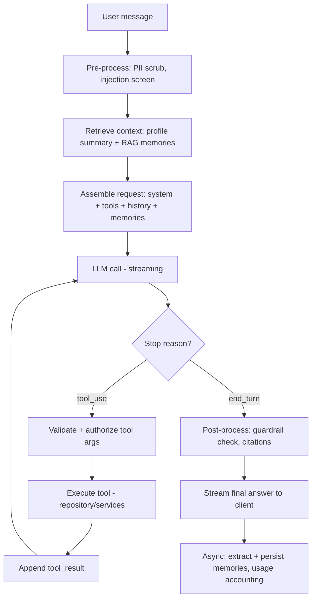

# 03 — Agent Architecture

The Agent is the product's primary interface. It is a **tool-using, memory-grounded coach** built
on Anthropic Claude (Sonnet) with a provider-abstraction layer for future model swaps.

## 1. Design goals

1. **Grounded, never hallucinated** — all user-specific facts come from tools/memory, not the model's guesses.
2. **Persistent** — the agent remembers across sessions (`docs/04`).
3. **Personalizable** — swappable coach personas without re-engineering the loop.
4. **Safe** — guardrails for medical advice, prompt injection, and PII.
5. **Provider-agnostic** — Claude today; OpenAI/Gemini/Grok/local tomorrow.
6. **Cost-aware** — prompt caching, memory summarization, model tiering, per-user budgets.

## 2. The agent loop



Implementation lives in `backend/app/agent/`. The loop is provider-agnostic; only the
`LLMProvider` adapter knows Anthropic's wire format.

## 3. System prompt structure (layered + cached)

The system prompt is assembled from cacheable layers (largest/most-stable first so Anthropic
**prompt caching** maximizes cache hits):

1. **Static base** (cached): role, safety rules, tool-use policy, formatting, persona-agnostic style.
2. **Persona layer** (cached per persona): tone & coaching philosophy (friendly/aggressive/scientific/…).
3. **User profile summary** (semi-stable, cached ~1h): structured snapshot from `profiles` + active goals.
4. **Retrieved memories** (dynamic): top-K relevant memories for this turn (`docs/04`).
5. **Today's context** (dynamic): date, recent logs summary, streaks, last workout.

```
[system, cache] base policy + safety + tool policy
[system, cache] persona: "scientific coach"
[system, cache] PROFILE: 28M, 82kg, 18% BF, goal: recomp, trains 4x/wk, knee injury(...)
[system]        MEMORIES: <top-K relevant>
[system]        TODAY: 2026-05-31, ate 1850kcal/180g protein so far, 3-day log streak
```

## 4. Provider abstraction layer

A single interface isolates the rest of the system from any vendor. Swapping models is a config
change, not a code change.

```python
# backend/app/agent/providers/base.py
class LLMProvider(Protocol):
    async def stream(
        self, *, system: list[SystemBlock], messages: list[Message],
        tools: list[ToolSpec], model: str, max_tokens: int,
    ) -> AsyncIterator[StreamEvent]: ...

    async def embed(self, texts: list[str], model: str) -> list[list[float]]: ...
```

Adapters: `AnthropicProvider` (default), `OpenAIProvider`, `GeminiProvider`, `GrokProvider`,
`LocalProvider` (vLLM/Ollama). Each adapter:
- translates the canonical `Message`/`ToolSpec`/`StreamEvent` types to/from the vendor SDK,
- normalizes tool-calling semantics,
- reports token usage in a common shape.

**Routing**: a `ModelRouter` picks the model by task + user tier:

| Task | Model tier | Example |
|---|---|---|
| Onboarding / chat | mid (Sonnet) | balance quality/cost |
| Quick classification / extraction | small (Haiku) | memory extraction, intent |
| Premium "deep" coaching | large (Opus) | program design for paid tier |
| Vision (food) | vision-capable | Claude vision or specialized CV (`docs/05`) |

## 5. Tool system

Tools are the agent's only way to touch user data. Each tool = JSON schema + a Python handler
that runs through the **same authorization layer** as the REST API (the agent can never exceed
the user's own permissions).

### 5.1 Tool registry pattern

```python
# backend/app/agent/tools/registry.py
@tool(
    name="get_recent_workouts",
    description="Return the user's recent workout sessions with sets. Use before giving "
                "training feedback so numbers are real.",
    schema={"type":"object","properties":{
        "limit":{"type":"integer","default":5,"maximum":20},
        "since_days":{"type":"integer","default":30}},
    },
)
async def get_recent_workouts(ctx: ToolContext, limit=5, since_days=30):
    return await ctx.workouts.recent(ctx.user_id, limit, since_days)
```

`ToolContext` carries the authenticated `user_id`, repositories/services, and a tracing span.
Tools are **read or write**; write tools require the user's own scope and are audit-logged.

### 5.2 Tool catalog (MVP)

| Tool | R/W | Purpose |
|---|---|---|
| `get_user_profile()` | R | Structured profile + completeness |
| `update_profile(fields)` | W | Persist facts learned in conversation |
| `get_recent_workouts(limit, since_days)` | R | Training history |
| `log_workout(session)` | W | Log a workout from conversation |
| `create_workout_plan(spec)` | W | Generate/persist a program |
| `get_nutrition_history(range)` | R | Food logs + daily totals |
| `search_food_database(query)` | R | Find canonical foods |
| `log_food(food_id, qty, meal)` | W | Log a meal |
| `analyze_food_image(s3_key)` | R/W | Trigger food vision pipeline (`docs/05`) |
| `get_progress_metrics(range)` | R | Weight/measurements/PRs/scores |
| `add_measurement(payload)` | W | Record measurement |
| `get_goals()` / `update_goal(...)` | R/W | Goal management |
| `recommend_content(filters)` | R | Pull from recsys (`docs/07`) |
| `recommend_people(filters)` | R | People/partner recs |
| `search_memories(query)` | R | Explicit memory recall |
| `remember(fact, type, importance)` | W | Write a long-term memory |
| `get_community_activity(...)` | R | Social context |

### 5.3 Tool-call safety

- **Schema-validated** args (Pydantic) before execution; reject/repair malformed calls.
- **Authorization**: every tool re-checks ownership/visibility via the service layer.
- **Budgeting**: max tool calls per turn (e.g. 8), with a forced summarize-and-answer fallback.
- **Determinism for writes**: write tools require explicit confirmation for destructive ops, and
  echo back what changed so the model (and user) can verify.
- **Timeouts & retries**: tool execution wrapped with timeout + circuit breaker.

## 6. Coach personas

Personas are prompt + config bundles, not separate code paths:

```yaml
# backend/app/agent/personas/scientific.yaml
key: scientific
display: "Scientific Coach"
tone: "evidence-based, cites mechanisms, precise, calm"
guardrails: ["always note uncertainty", "prefer ranges over false precision"]
defaults: { verbosity: medium, emoji: false }
nudge_style: "data-driven weekly reviews"
```

Personas: **friendly, aggressive, scientific, sports, nutrition, recovery**. The user switches
anytime; persona is stored on `profiles.coach_persona` and per-conversation override.

## 7. Proactive agent (nudges)

Beyond request/response, the agent runs **scheduled reflections** (Celery beat):
- Daily: check logging streaks, deficit/surplus adherence → optional push nudge.
- Weekly: generate a progress insight (lifts stalled? weight trend? adherence?) → notification + memory.
- Event-driven: new PR → congratulate; 3 missed days → gentle accountability ping.

Nudges respect quiet hours, frequency caps, and user notification preferences.

## 8. Cost & latency controls

- **Prompt caching** on the static/persona/profile layers (big win for chatty users).
- **Memory summarization**: long conversations compacted into a running summary + episodic memories,
  so the live context window stays small.
- **Model tiering** via `ModelRouter` (Haiku for extraction/intent, Sonnet for chat).
- **Per-user token budgets** by tier; soft-degrade (smaller model / shorter context) before hard cap.
- **Streaming first token** target < 1.5s; tools executed concurrently when independent.

## 9. Observability

Every turn emits a trace: retrieved memory ids, tool calls + latencies, model, token usage,
guardrail verdicts, and a thumbs feedback hook. Stored for evals and prompt/A-B iteration.
LLM I/O is logged with PII redaction and sampling.

## 10. Evaluation

- **Offline eval set**: curated conversations with expected tool calls / grounded answers.
- **Groundedness check**: assert numeric claims trace to a tool result.
- **Regression gate** in CI for prompt/persona changes.
- **Online**: thumbs-up rate, correction rate, task completion, retention lift.
