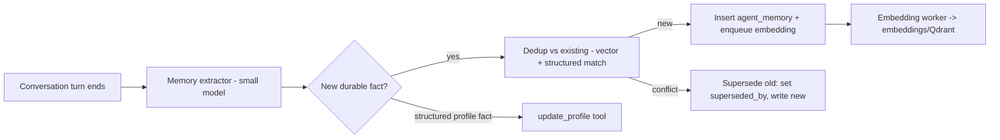
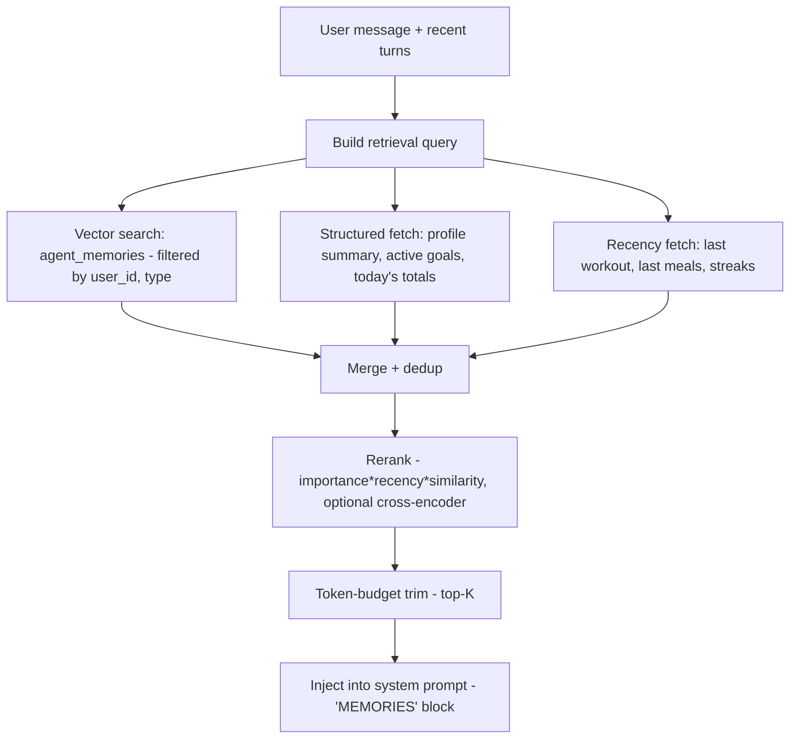

# 04 — AI Memory & RAG Architecture

The agent's superpower is that it *remembers*. This document defines the memory tiers, how
memories are written/decayed/retrieved, and the RAG pipeline that runs before every response.

## 1. Memory tiers

| Tier | Lives in | Lifetime | Purpose |
|---|---|---|---|
| **Working / short-term** | Request context | one turn | The active conversation window |
| **Conversation memory** | `messages` + running summary | per conversation | Recent dialogue, compacted when long |
| **Profile memory** | `profiles` (structured) | durable | Stable facts: stats, goals, equipment, injuries |
| **Long-term semantic** | `agent_memories` + `embeddings` | durable, decaying | Atomic facts/observations, vector-searchable |
| **Behavior memory** | `agent_memories(type=behavior)` + analytics rollups | durable | Adherence, patterns, motivation signals |
| **Goal memory** | `goals` + `agent_memories(type=goal)` | durable | Current/historical goals & rationale |
| **Reflection memory** | `agent_memories(type=reflection)` | durable | Periodic AI-generated syntheses |

The split mirrors human memory: fast working context, structured "facts I know about you," and a
searchable episodic/semantic store.

## 2. Memory lifecycle

### Writing memories
Two paths:
1. **Explicit** — the agent calls `remember(fact, type, importance)` or `update_profile(...)`.
2. **Implicit** — an async extractor (Haiku-tier) reads each completed turn and proposes
   memories (`{type, content, structured, importance, confidence}`), which are deduped and stored.

### Dedup & conflict resolution
- Candidate memory is embedded and compared (cosine) to existing memories of the same `type`.
- High similarity + structured match → **update/supersede** (set `superseded_by`, bump confidence).
- Contradiction (e.g. weight changed) → write new, mark old `superseded_by`, keep history.

### Decay & importance
- `importance ∈ [0,1]` (model-assigned) × recency × `use_count` → effective retrieval weight.
- Time-sensitive facts get `valid_until` (e.g. "currently cutting" expires; "torn ACL 2024" doesn't).
- A nightly job decays unused low-importance episodic memories and compacts them into reflections.

## 3. Embeddings

- Embed memories, foods, posts, exercises, and a profile summary vector.
- Model via provider abstraction (`embed()`); `embeddings.model` records which model produced each
  vector so re-embedding on model change is tracked.
- Storage: `pgvector` HNSW at MVP; mirror to **Qdrant** (named per-user collections/payload
  filtering) when vector QPS or recall needs outgrow Postgres (`docs/15`).

## 4. RAG retrieval pipeline (runs before each response)

### Retrieval details
- **Query construction**: last user message + a short rolling summary → embedding.
- **Filters**: always `user_id`; optionally `type` based on detected intent (nutrition question →
  prioritize `nutrition`/`food` memories).
- **Hybrid**: vector similarity + structured must-haves (active goals, injuries always included
  regardless of similarity — safety-critical context).
- **Rerank**: `score = w1·cosine + w2·importance + w3·recency_decay + w4·use_count`. Optional
  cross-encoder rerank for premium tier.
- **Budget**: cap injected memories (e.g. top-12, ≤ ~1.5k tokens) to control cost/latency.
- **Cache**: `rag:{user_id}:{hash(query)}` for 10 min; invalidated on memory write.

### Always-on safety context
Injuries, allergies, and active medical restrictions are **always** injected (not subject to
similarity cutoff) so the agent never recommends something contraindicated.

## 5. RAG sources (beyond memories)

| Source | How retrieved | Used for |
|---|---|---|
| User memories | vector + filter | personalization, history |
| Workout history | structured query (tools) | training feedback |
| Nutrition history | structured query (tools) | diet feedback |
| Progress data | structured query (tools) | trend insights |
| Community activity | structured query | social context |
| **Knowledge base** | vector search over curated fitness/nutrition KB | grounded science, not user data |

The **knowledge base** is a separate, public, versioned corpus (exercise science, nutrition
guidelines, technique cues) embedded once and shared across users — keeps the agent's general
advice grounded and citable, separate from private memory.

## 6. Privacy & memory governance

- Memories are strictly **per-user namespaced**; cross-user retrieval is impossible by construction
  (filter on `user_id` + optional Postgres RLS).
- Users can **view, edit, and delete** memories ("what do you remember about me?") — transparency is
  a trust feature. Deletion cascades to embeddings.
- Sensitive inferences (e.g. health conditions) require higher confidence to persist and are flagged.
- Memory writes are audit-logged; `user.deleted` purges all memories + vectors (`docs/11`).

## 7. Failure modes & mitigations

| Failure | Mitigation |
|---|---|
| Stale memory ("still cutting" months later) | `valid_until`, supersession, weekly reflection refresh |
| Contradictory memories | conflict resolution writes supersession chain, latest wins |
| Retrieval miss (relevant memory not surfaced) | hybrid + always-on safety context + explicit `search_memories` tool |
| Embedding drift on model change | `embeddings.model` tracked; background re-embed job |
| Cost blowup from huge histories | summarization + decay + top-K budget |
