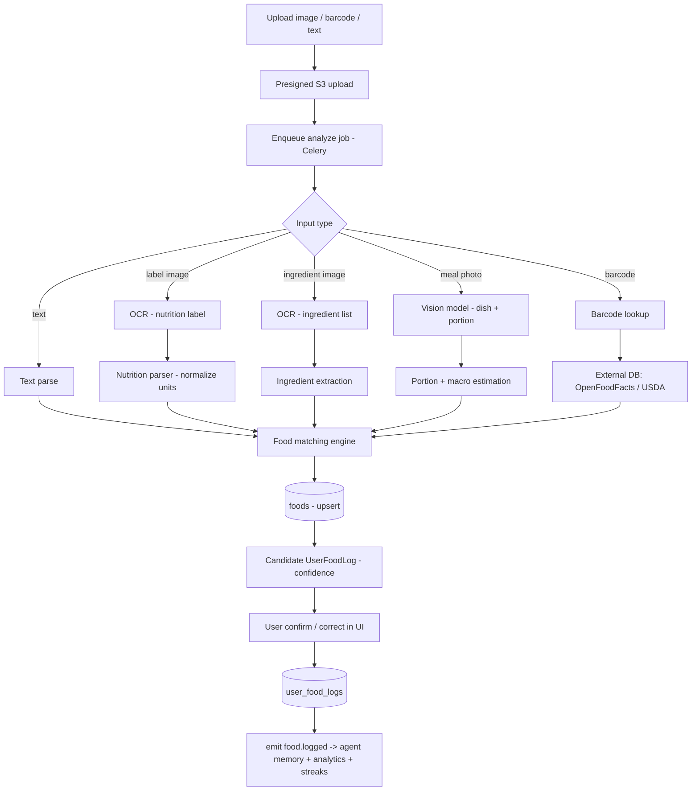

# 05 — Food Intelligence System

Goal: let a user log a meal in seconds from a **photo, nutrition label, ingredient list, barcode,
or text**, with accurate macros, and make every log permanent and agent-accessible.

## 1. Pipeline overview

## 2. Inputs & strategies (best → fallback)

| Input | Primary method | Accuracy lever |
|---|---|---|
| **Barcode** | GTIN lookup vs `foods` then OpenFoodFacts/USDA | highest accuracy; cache by barcode |
| **Nutrition label photo** | OCR (textract/PaddleOCR) → structured parse | per-serving table is authoritative |
| **Ingredient list photo** | OCR → ingredient extraction → estimate | for unlabeled/allergen detection |
| **Meal photo** | Vision model: dish classification + portion estimation | hardest; ±20% kcal target |
| **Text** ("2 eggs and toast") | LLM/NLP entity+quantity parse → match | quick path |

**Barcode-first UX**: prompt users to scan packaging when present — it's the cheapest, most
accurate path and seeds the canonical DB.

## 3. Component design

### 3.1 OCR
- Managed: **AWS Textract** (label tables) for reliability; OSS fallback **PaddleOCR**.
- Output normalized to `{calories, protein, carbs, fat, fiber, sugar, sodium, serving_size, serving_unit}`.
- Unit normalization (kJ→kcal, mg/g), per-serving vs per-100g reconciliation, "% daily value" ignored.

### 3.2 Vision (meal photos)
- **MVP**: Claude vision (multimodal) prompted to return strict JSON: detected items, estimated
  grams, and per-item macros, plus a confidence per item. Cheap to build, surprisingly good.
- **Scale**: dedicated CV — a fine-tuned food classifier (e.g. on Food-101 + proprietary corrections)
  + a portion/volume estimator (reference-object or depth cues), served on GPU. Vision LLM remains
  the fallback for long-tail dishes.
- Always returns **confidence**; low confidence → UI asks the user to confirm/adjust portions.

### 3.3 Ingredient extraction
- From ingredient-list OCR or vision: produce a structured ingredient array; flag allergens against
  the user's `profiles.allergies` and warn pre-log.

### 3.4 Nutrition parsing & health score
- `health_score ∈ [0,100]` computed from a transparent rubric: protein density, fiber, added sugar,
  sodium, processing level (NOVA-like heuristic), micros. Stored on `foods.health_score`.
- Personalized overlay at read time (e.g. high-sodium penalized more for a hypertension restriction).

### 3.5 Food matching engine
Resolves a parsed item to a canonical `foods` row:
1. **Exact**: barcode match.
2. **Lexical**: trigram similarity on `foods.search_text` (`pg_trgm`).
3. **Semantic**: embedding similarity (food name + brand) for fuzzy/branded items.
4. **Threshold**: above τ → reuse existing food; below → **create** a new `foods` row
   (`verified_status='unverified'`, `created_by=user`) and enqueue for staff/community verification.
- Deduplication job merges near-duplicate foods and reassigns logs.

## 4. Data model touchpoints

- Canonical nutrition: `foods` (per-serving, with `barcode`, `health_score`, `verified_status`).
- The log: `user_food_logs` **snapshots** macros at log time (so later food edits don't rewrite
  history), records `source`, `confidence`, `image_s3_key`.
- Daily totals computed on the fly (partition-pruned query) and cached per `(user_id, date)`.

## 5. Agent integration

Once logged, the agent can reason over it via tools:

> **User:** "Can I eat this again?"
> Agent calls `get_nutrition_history()` + `search_food_database()` →
> **Agent:** "You've had this 5× this week (~38g added sugar each). Given your fat-loss goal and
> that you're at 92% of today's carb target, I'd keep it to once more this week or swap for X."

`food.logged` events feed:
- **agent memory** (preference/nutrition memories: "dislikes cottage cheese", "eats oats daily"),
- **streaks & adherence** (behavior memory + `consistency_score`),
- **analytics** (nutrition adherence metric).

## 6. Feedback loop (accuracy compounding)

User corrections (wrong food, wrong portion) are gold:
- Corrections update the log **and** are stored as labeled training data (`food.correction` event).
- Periodically retrain/fine-tune the vision classifier and tune matching thresholds.
- Frequently-corrected foods get prioritized for staff verification.

## 7. Latency & cost

- Whole meal-photo analysis target **< 8s**; barcode/label **< 3s**.
- Async via Celery with WebSocket/poll for result; UI shows optimistic "analyzing…" state.
- Cost controls: cache barcode lookups (24h), reuse canonical foods aggressively, batch embeddings,
  use vision LLM only when needed (not for barcoded items).

## 8. Edge cases

| Case | Handling |
|---|---|
| Mixed plate (multiple dishes) | Vision returns item array; user can remove/add items |
| Restaurant meal, no label | Match to brand menu DB if available; else estimate + low confidence |
| Homemade recipe | Build from ingredients; save as a reusable "recipe" food owned by user |
| Non-food image | Classifier rejects; agent asks for a clearer photo |
| Conflicting label vs barcode | Label (on-pack) wins for that log; flag discrepancy |
