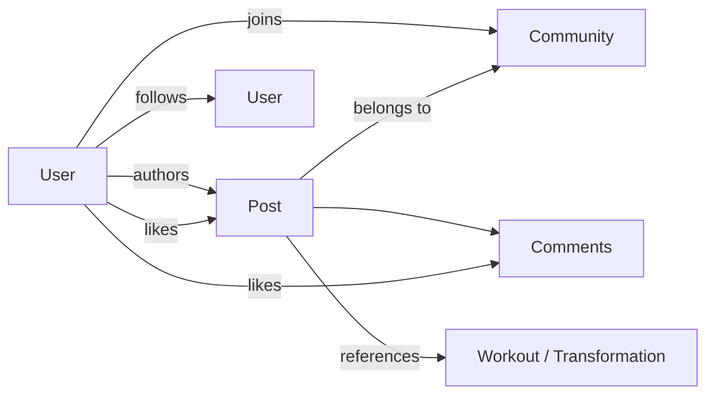

# 06 — Social Network Architecture

Forge's social layer = **Reddit (communities/discussion) + Instagram (visual profiles/posts) +
Strava (activity sharing)**. It must scale to a large graph and feed the recommendation system.

## 1. Entities & relationships

- **Profiles** — public face of a user (stats opt-in, communities, transformation timeline).
- **Posts** — text / image / video / workout / transformation / question (see `post_kind`).
- **Comments** — threaded (`parent_id`), with likes.
- **Communities** — subreddit-like (gym, calisthenics, running, cycling, powerlifting, sports,
  nutrition…), public or private, with moderators.
- **Likes / Shares** — engagement on posts and comments.
- **Follows** — directed graph (asymmetric, like IG/Twitter).
- **Creator/Coach profiles** — verified roles with extra surfaces (programs, marketplace later).



## 2. The two social loops

1. **Interest graph (Reddit-like)**: communities. Content discovery driven by topic affinity —
   works at cold start (no social graph needed). This is the **primary** loop for activation.
2. **Social graph (IG/Strava-like)**: follows. Drives retention and identity once a user has
   connections; powers the "following" feed and transformation journeys.

Feed blends both (`docs/07`).

## 3. Posting & media

- Media uploaded via presigned S3 URLs; images transcoded to multiple sizes, video to HLS by a
  worker; served via CloudFront. `posts.media` stores the manifest.
- Posts can **reference fitness entities** (`ref_entity`): attach a workout session, a PR, a
  transformation comparison, or a meal — turning logged data into shareable content (Strava-style).
- **Transformation journeys**: a first-class view that stitches `progress_photos` + measurement
  timeline into a before/after story the user can publish with chosen visibility.

## 4. Graph storage & scale

- **MVP**: `follows`, `community_members` in Postgres with reverse indexes
  (`ix_follows_followee`, `ix_comm_members_user`). Sufficient to millions of edges.
- **Scale**: hot graph queries (mutuals, 2nd-degree, "people you may know") move to a
  **graph-optimized store** or precomputed adjacency in Redis; or a dedicated service backed by a
  graph DB. Edge events flow through Kafka (`follow.created`) to keep derived stores in sync.

## 5. Feed generation (overview; ranking in `docs/07`)

Hybrid fan-out:
- **Fan-out-on-write (push)** for normal accounts (< N followers): on `post.created`, a worker
  pushes the post id into each follower's Redis feed list. Fast reads.
- **Fan-out-on-read (pull)** for large accounts / communities: don't fan out to millions; merge
  their recent posts at read time. Avoids the "celebrity" write storm.
- Final feed = merge(pushed personalized candidates, pulled big-account/community posts,
  recsys candidates) → rank → paginate (cursor-based).

```mermaid
sequenceDiagram
    participant A as Author
    participant S as Social svc
    participant K as Kafka
    participant F as Feed worker
    participant R as Redis
    A->>S: create post
    S->>K: post.created
    alt author followers < N
      K->>F: fan-out-on-write
      F->>R: LPUSH feed:{follower} post_id (capped list)
    else large author
      Note over F: skip; pulled at read time
    end
```

## 6. Moderation & trust

- **Trust score** per user/post (`posts.trust_score`) from account age, verification, prior
  violations, engagement authenticity → influences ranking and rate limits.
- **Content moderation**: automated screening (vision + text classifiers + LLM policy check) on
  upload for nudity/violence/spam/medical-misinformation; community-specific rules enforced by
  moderators; user reporting → moderation queue.
- **Anti-abuse**: rate limits on posting/commenting/following (Redis), shadow-limits for spam,
  bot detection on engagement patterns.

## 7. Counters & denormalization

`like_count`, `comment_count`, `share_count`, `member_count` are denormalized columns updated by
the engagement worker (consuming `post.engaged`), with periodic reconciliation against source
tables. Reads never aggregate `likes` at request time.

## 8. Notifications

`notifications` (partitioned) + push (APNs/FCM). Types: like, comment, follow, mention, community
post, agent nudge, challenge. Batched/debounced ("X and 4 others liked your post"), respect user
prefs and quiet hours.

## 9. Privacy controls

- Per-entity visibility: `public | followers | private` on posts and progress photos.
- Profile stat visibility is opt-in (weight/BF% never public by default).
- Private communities require approval; private accounts gate follows.
- Blocking/muting; blocked users removed from each other's feeds and graph queries.
