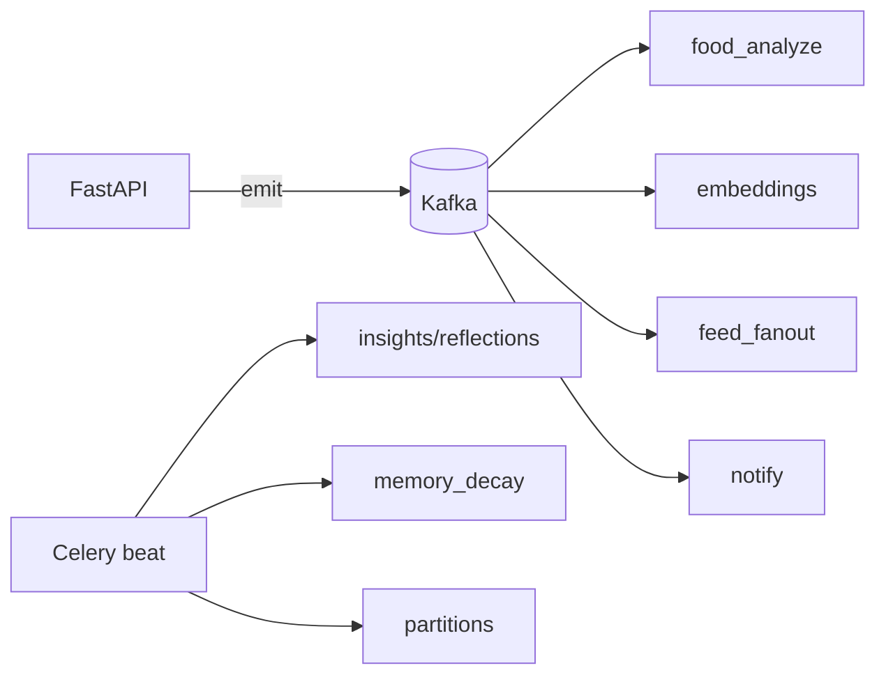

# 09 — Backend Architecture

FastAPI (Python 3.12), async end-to-end. Starts as a **modular monolith** with clean domain
boundaries, ready to extract services (agent, food-ML, recsys) under load.

## 1. Layered design

```
HTTP / WS  →  Routers (api/v1)        # validation, auth dep, serialization
           →  Services (app/services) # business logic, orchestration, events
           →  Repositories (db/repos) # data access, query construction
           →  Models (db/models)      # SQLAlchemy ORM
External:     Agent runtime, ML services, providers, integrations
Async:        Celery workers consume Kafka / run scheduled jobs
```

Rules: routers never touch the ORM directly; services never build raw SQL ad hoc; repositories are
the only DB access; cross-domain calls go service→service (or via events), never repo→repo.

## 2. Folder structure (`backend/`)

```
backend/
├── app/
│   ├── main.py                  # FastAPI app factory, middleware, lifespan
│   ├── api/
│   │   ├── deps.py              # auth, db session, rate-limit, pagination deps
│   │   └── v1/
│   │       ├── router.py        # aggregates route modules
│   │       └── routes/
│   │           ├── auth.py
│   │           ├── users.py
│   │           ├── profiles.py
│   │           ├── agent.py     # chat (SSE), conversations
│   │           ├── workouts.py
│   │           ├── nutrition.py # foods, logs, analyze
│   │           ├── progress.py
│   │           ├── social.py    # posts, comments, likes, follows
│   │           ├── communities.py
│   │           ├── feed.py
│   │           ├── recommendations.py
│   │           ├── notifications.py
│   │           └── uploads.py   # presigned URLs
│   ├── core/
│   │   ├── config.py            # pydantic-settings (12-factor)
│   │   ├── security.py          # JWT, password hashing, OAuth verify
│   │   ├── logging.py           # structlog + OTEL
│   │   ├── errors.py            # exception types + handlers
│   │   ├── ratelimit.py
│   │   └── events.py            # Kafka producer/consumer wrappers
│   ├── db/
│   │   ├── base.py              # Base, engine, session factory
│   │   ├── session.py           # async session dep
│   │   ├── models/              # SQLAlchemy models (one file per domain)
│   │   └── repositories/        # data access objects
│   ├── schemas/                 # Pydantic request/response (one file per domain)
│   ├── services/                # business logic per domain
│   │   ├── auth_service.py
│   │   ├── profile_service.py
│   │   ├── workout_service.py
│   │   ├── nutrition_service.py
│   │   ├── social_service.py
│   │   ├── feed_service.py
│   │   └── notification_service.py
│   ├── agent/                   # AGENT SUBSYSTEM (docs/03, 04)
│   │   ├── orchestrator.py      # the agent loop
│   │   ├── providers/           # base.py, anthropic.py, openai.py, ...
│   │   ├── router.py            # ModelRouter (tiering)
│   │   ├── prompt.py            # layered system prompt assembly + caching
│   │   ├── tools/               # registry.py + tool handlers
│   │   ├── memory/              # extractor.py, retriever.py (RAG), store.py
│   │   └── personas/            # *.yaml
│   ├── ml/
│   │   ├── food/                # ocr.py, vision.py, parser.py, matcher.py, health_score.py
│   │   └── recsys/              # candidates.py, ranker.py, features.py
│   ├── integrations/            # s3.py, anthropic_sdk.py, oauth_google.py, oauth_apple.py, push.py
│   ├── workers/
│   │   ├── celery_app.py
│   │   ├── beat.py              # scheduled (reflections, partitions, decay)
│   │   └── tasks/               # food_analyze.py, embeddings.py, fanout.py, notify.py, insights.py
│   └── utils/
├── alembic/                     # migrations
├── tests/                       # unit + integration (pytest, httpx, testcontainers)
├── pyproject.toml
├── Dockerfile
└── docker-compose.yml           # local: pg, redis, kafka(redpanda), qdrant, minio
```

## 3. Request lifecycle (CRUD)

1. Middleware: request id, tracing span, auth context, rate-limit check.
2. Router: validate body/query (Pydantic), resolve deps (`get_current_user`, `get_db`).
3. Service: business logic, transaction boundary, emit domain event.
4. Repository: execute query within the session.
5. Response: serialize via Pydantic schema; counters/caches updated; event published.

## 4. Async & event-driven

- **Celery** for: food analysis, embedding generation, feed fan-out, notifications, weekly
  insights, profile-score recompute, GDPR export/delete, partition maintenance.
- **Kafka** topics (`docs/01 §6`) decouple producers from consumers. Workers are idempotent
  (event id dedup) and retry with backoff → DLQ on repeated failure.
- **Celery beat** schedules reflections (`docs/03 §7`), memory decay (`docs/04 §2`), partition
  pre-creation (`docs/02 §5`).



## 5. Agent endpoint (streaming)

`POST /api/v1/agent/messages` returns **SSE**. The route delegates to `agent.orchestrator.run()`,
which streams tokens and tool-call events. WebSocket alternative at `/ws/agent` for bidirectional.
Tool execution reuses the same services/repos as REST (single source of truth for authz + logic).

## 6. Configuration & DI

- `pydantic-settings` reads env; typed `Settings` singleton.
- FastAPI dependency injection for DB session, current user, rate limiter, feature flags, and
  service instances → trivially testable (override deps in tests).

## 7. Error handling & contracts

- Typed exceptions (`NotFoundError`, `PermissionError`, `ValidationError`, `RateLimited`,
  `ProviderError`) mapped to RFC 9457 *problem+json* responses.
- All responses typed via Pydantic; OpenAPI auto-generated → client SDK generation for web/mobile.

## 8. Performance

- Async SQLAlchemy 2.0 + asyncpg; connection pooling via **PgBouncer** (transaction mode).
- N+1 avoided via explicit joins/`selectinload`; pagination is **cursor-based** (keyset) on
  time-ordered tables.
- Hot reads cached in Redis (`docs/02 §6`); heavy work pushed to workers.
- Uvicorn/Gunicorn workers behind the ingress; HPA on CPU + concurrency (`docs/12`).

## 9. Testing

- **Unit**: services with mocked repos/providers.
- **Integration**: real Postgres/Redis/Kafka via **testcontainers**; HTTP via `httpx.AsyncClient`.
- **Agent evals**: scripted conversations asserting tool calls + groundedness (`docs/03 §10`).
- **Contract**: OpenAPI snapshot tests so client SDKs don't break silently.
