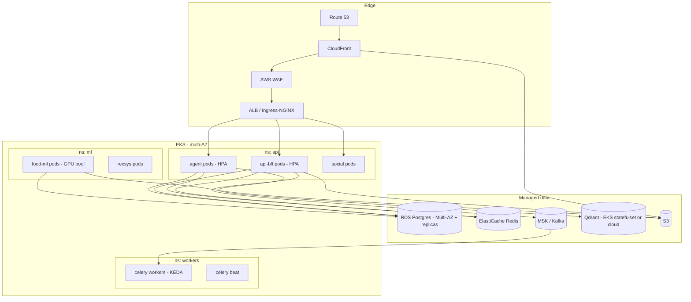
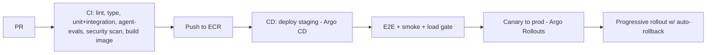

# 12 — Deployment & Infrastructure

Cloud: **AWS**. Orchestration: **Kubernetes (EKS)**. IaC: **Terraform**. Everything reproducible,
multi-AZ, autoscaled.

## 1. Topology

## 2. Containers & images

- Multi-stage Dockerfiles; distroless/slim runtime; non-root user; pinned base + Trivy scan.
- Images: `api-bff`, `agent`, `food-ml` (GPU base), `recsys`, `worker` (shared codebase, different
  entrypoints/commands — modular monolith → split images as services extract).
- Pushed to **ECR**; immutable tags = git SHA.

## 3. Kubernetes

- **Deployments** for stateless services; **HPA** on CPU + custom concurrency/latency metrics.
- **KEDA** scales Celery workers on Kafka lag / queue depth (scale-to-near-zero off-peak).
- GPU node group (food-ml vision at scale) with taints/tolerations; CPU node groups otherwise;
  spot instances for workers, on-demand for API.
- `PodDisruptionBudgets`, `requests/limits`, liveness/readiness/startup probes, topology spread.
- Config via ConfigMaps; secrets via **External Secrets Operator** ← AWS Secrets Manager.
- Ingress: NGINX (or ALB controller) + cert-manager (ACM).
- Layout: `infra/k8s/base` (kustomize) + `overlays/{staging,prod}`.

## 4. Data layer ops

- **RDS Postgres** Multi-AZ, read replicas for read-heavy paths; **PgBouncer** (transaction mode)
  in-cluster for pooling. Automated snapshots + PITR. Partition maintenance job (`docs/02 §5`).
- **ElastiCache Redis** (cluster mode) for cache/queues/rate-limits.
- **MSK** (Kafka) multi-broker; Schema Registry at scale.
- **Qdrant** as statefulset (or managed) once vector load graduates from pgvector.
- **S3** with lifecycle policies (transition to IA/Glacier for old media, archive cold partitions).

## 5. CI/CD

- **GitHub Actions** for CI (`.github/workflows`): lint (ruff), type (mypy/pyright), tests
  (pytest + testcontainers), agent eval gate, OpenAPI snapshot, SAST/SCA, Docker build+scan.
- **Argo CD** (GitOps) for deploys; **Argo Rollouts** for canary/blue-green with metric analysis
  (error rate, latency, agent error rate) → auto-rollback.
- DB migrations via Alembic run as a pre-deploy K8s **Job** (expand/contract pattern for zero-downtime).
- Mobile: **EAS Build/Update**; web: build → S3 + CloudFront invalidation.

## 6. Observability

- **Metrics**: Prometheus + Grafana (RED/USE dashboards per service; LLM cost/token dashboards;
  feed CTR; food-pipeline latency). Alertmanager → PagerDuty.
- **Tracing**: OpenTelemetry → Tempo/Jaeger; traces span BFF→agent→tools→DB→LLM.
- **Logs**: structured JSON (structlog) → Loki / CloudWatch / OpenSearch; PII-redacted.
- **Errors**: Sentry (backend + mobile + web).
- **SLOs**: API p95 < 250ms, first agent token < 1.5s, 99.9% availability; error budgets drive
  release pace.
- **Synthetics**: uptime + critical-flow probes (login, chat, food log).

## 7. Cost controls

- Spot for workers/ML batch; autoscale-to-low off-peak; S3 lifecycle; right-sized RDS with
  replicas; **LLM cost governance** (caching, tiering, budgets — `docs/03 §8`) tracked on a Grafana
  cost dashboard with alerts.

## 8. Environments & DR

- `local` (docker-compose: pg, redis, redpanda, qdrant, minio) → `dev` → `staging` → `prod`.
- Prod multi-AZ; cross-region async replica + S3 CRR for DR. RPO ≤ 5 min, RTO ≤ 1 h targets.
- Backups tested via periodic restore drills; runbooks in repo.
