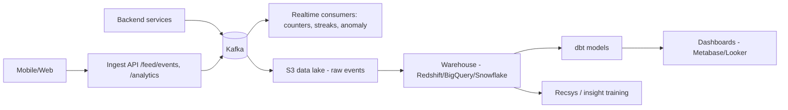
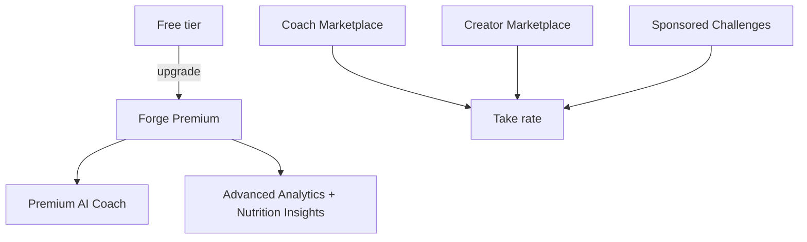

# 13 — Analytics & Monetization

## Part A — Analytics

### 1. Event pipeline

- Client + server emit typed events; `analytics_events` (Postgres, partitioned) is the durable
  short-term store, but the **lake + warehouse** is the analytics system of record.
- A product-analytics tool (PostHog/Amplitude/Segment) can front client events early-stage.

### 2. Core metrics

| Category | Metrics |
|---|---|
| Growth | signups, activation rate, invites, K-factor |
| Engagement | **DAU/MAU**, stickiness (DAU/MAU), sessions, session length |
| Retention | D1/D7/D30, W4, cohort curves, resurrection |
| Core loops | workout completion rate, **nutrition adherence**, meals logged/user, log streaks |
| Agent | messages/user/wk, tool-grounded answer rate, thumbs-up rate, time-to-first-token |
| Social | posts/comments/follows/joins, feed CTR, dwell, content creation rate |
| Recsys | feed CTR, follow-through on recs, NDCG (offline) |
| Monetization | conversion to premium, MRR/ARR, LTV, churn, ARPU |
| Reliability/cost | SLO attainment, LLM tokens & $/active user, infra $/user |

### 3. North Star

**Weekly Active Loggers who also engage socially** — captures the AI-coaching loop *and* the social
loop together; both must fire for durable retention.

### 4. Experimentation

- Feature-flag-driven A/B (flags in `feature_flags`, assignment hashed by user id).
- Guardrail metrics on every experiment (retention, healthy-behavior outcomes, cost) so we don't
  optimize engagement at the expense of user outcomes.
- Holdouts for recsys/agent changes; CUPED variance reduction at scale.

## Part B — Monetization

### 1. Model: freemium + marketplace + brand

### 2. Tiers

| Tier | Price (illustrative) | Includes |
|---|---|---|
| **Free** | $0 | Agent (Sonnet, capped tokens/day), food logging, workouts, social, basic feed |
| **Premium** | ~$12–15/mo | Higher token budget + deeper model tier (Opus) for plans, advanced analytics, unlimited photo food logging, priority pipeline, advanced progress insights, ad-free |
| **Premium+/Coach** | ~$25–30/mo | Human-coach add-ons, programming exports, early features |

### 3. Revenue streams

1. **Premium subscriptions** (primary) — App Store/Play + Stripe (web).
2. **Premium AI Coach** — higher-tier model, proactive accountability, deeper personalization.
3. **Nutrition Insights / Advanced Analytics** — premium-gated dashboards & reports.
4. **Coach Marketplace** — vetted human coaches sell programs/1:1; platform take rate; agent
   assists & monitors adherence between sessions.
5. **Creator Marketplace** — creators sell programs/challenges; revenue share.
6. **Sponsored Challenges** — brands sponsor community challenges (clearly labeled, quality-gated).
7. (Later) **B2B/gym** licensing; affiliate on verified gear/supplements (transparent).

### 4. Monetization principles

- **Never paywall safety or core logging** — the healthy-behavior loops must stay free to maximize
  the user base and the social network's value.
- LLM cost is the main variable cost → token budgets + tiering keep free-tier margin sane; premium
  unlocks the expensive model tiers where willingness-to-pay is highest (custom programming).
- Ads, if ever, are non-intrusive sponsored content subject to the same quality/trust ranking.

### 5. Unit economics levers

- COGS/user ≈ LLM tokens + food-vision inference + storage/CDN + infra. Drive down via prompt
  caching, model tiering, memory summarization, canonical-food reuse, spot/GPU batching.
- LTV via retention (the agent's memory = a moat; switching cost grows with history) and
  cross-loop engagement (social retains, coaching converts).
